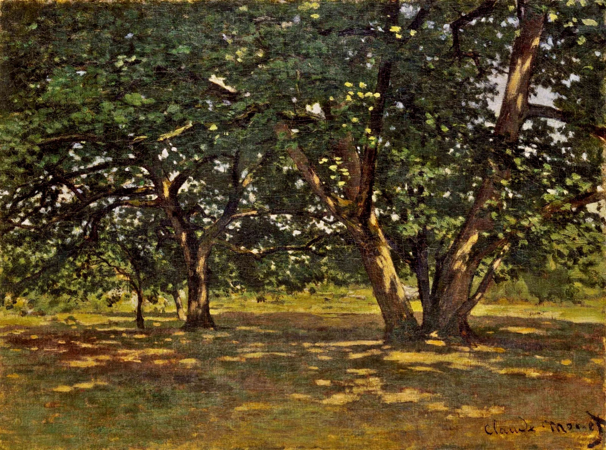
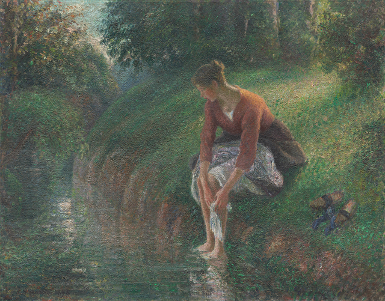
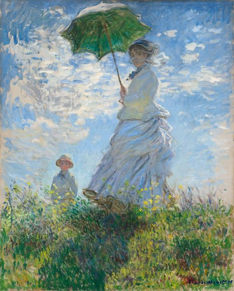
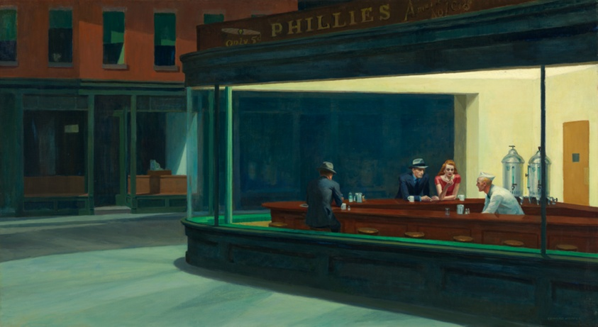
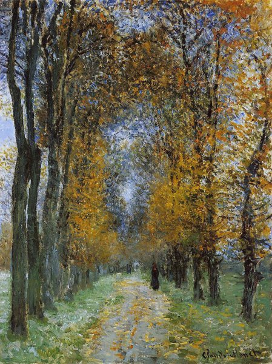
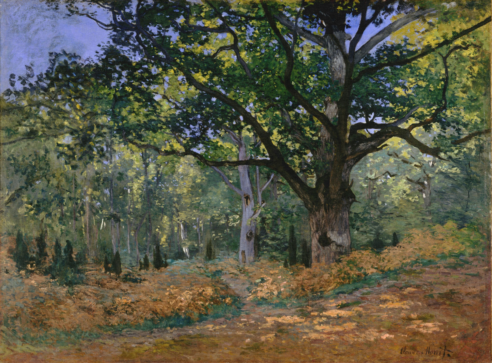
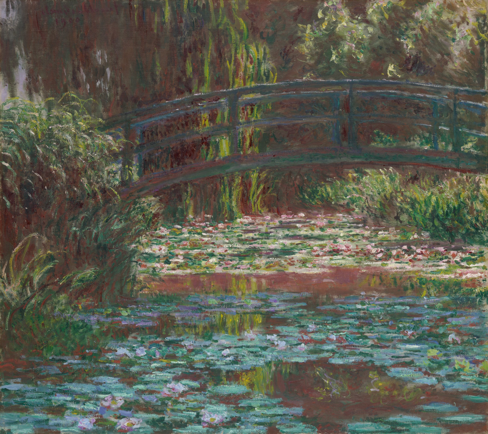
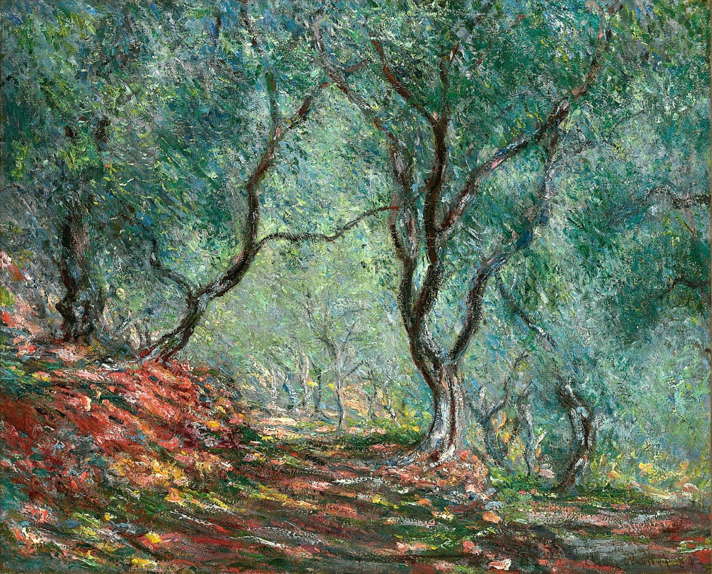

### Fontainebleau Forest, 1865, Claude Monet
{: width="250" }

### Woman Bathing Her Feet in a Brook, 1895, Camille Pissarro (French, 1830–1903)
{: width="250" }

### Woman with a Parasol - Madame Monet and Her Son, 1875 Claude Monet (1840-1926)
{: width="250" }

### The Japanese Footbridge and the Water Lily Pool, Giverny, 1899 Claude Monet (1840-1926)
{: width="250" }

### Nighthawks, 1942, Edward Hopper (American, 1882–1967)
{: width="250" }

### The Avenue (1878) by Claude Monet
{: width="250" }

### The Bodmer Oak, Fontainebleau, 1865, Claude Monet
{: width="250" }

### Water Lily Pond, 1900, Claude Monet
{: width="250" }

### Olive Tree Wood in the Moreno Garden, Claude Monet
{: width="250" }

### Pink peach trees ('Souvenir de Mauve'), 1888, Vincent van Gogh
{: width="250" }

 

